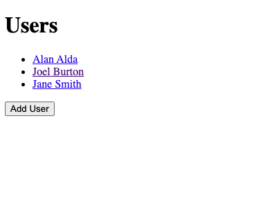
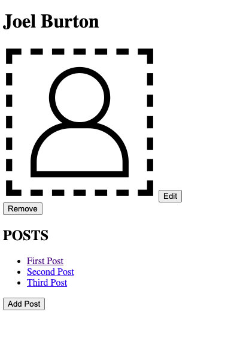
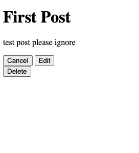

# Flask Blogly

Flask app utilizing PostgreSQL and SQLAlchemy

## To run 

1. Open the project subfolder  
2. Create a virtual environment  

        python3 -m venv venv  

3. Install from requirements.txt  

        pip3 install -r requirements.txt  

4. Enter an IPython session and run:

        ipython
        [1]: %run app.py
        [2]: db.create_all()

5. Run with flask  

        flask run  
    
    For Macs, usually some process already listen on port 5000 and you'll need to run  

        flask run -p 5001  

6. Then visit localhost:5000 or localhost:5001 on your browser  

## Screenshots

1. Homepage displays users

2. User page displays posts

3. Post edit page

